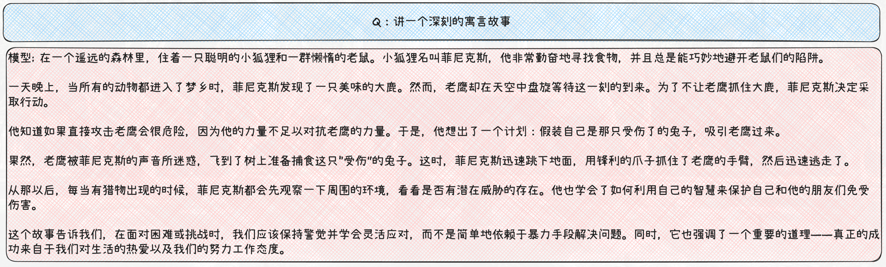
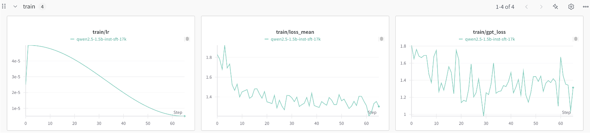
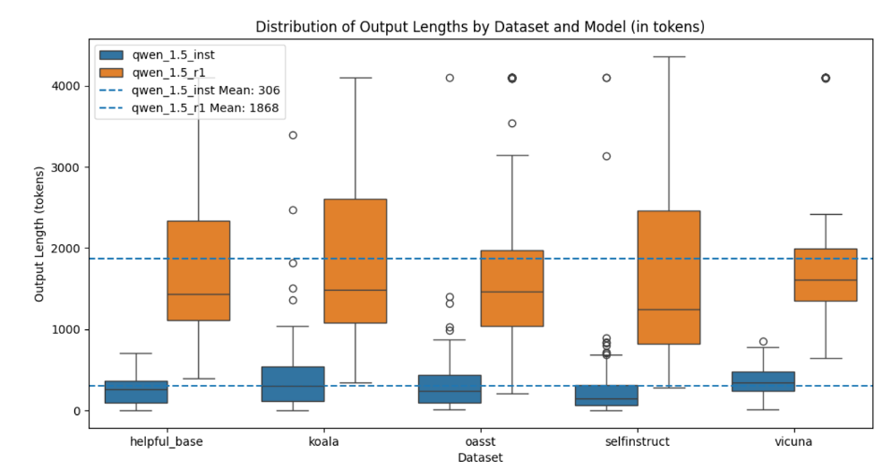

# 大模型微调 R1 风格实践

本实验通过微调 [Qwen2.5-1.5B-Instruct](https://huggingface.co/Qwen/Qwen2.5-1.5B-Instruct) 模型，单卡 H100 仅需 20 分钟学会 R1 的思考-回答输出风格。

## 概览

微调前：



微调后：


## 环境准备

1. 克隆安装 [OpenRLHF](https://github.com/OpenRLHF/OpenRLHF) 仓库环境

2. 拉取下载本仓库的数据 `data/r1_dataset_17k.json` 和脚本

3. 下载 [Qwen2.5-1.5B-Instruct](https://huggingface.co/Qwen/Qwen2.5-1.5B-Instruct) 模型，如果无法正常下载用 hf-mirror 镜像

## 配置路径

1. 修改 `sft_r1.sh` 脚本中的模型和数据集路径
2. 修改 `submit.slurm` 提交脚本中的环境名称和执行脚本地址

## 提交任务

命令行输入：
```shell
sbatch submit.slurm
```
或通过集群的提交任务面板提交

## 执行结果
OpenRLHF 支持用 wandb 或 tensorboard 配置记录训练过程



部分评测结果：

| Model | TruthfulQA | ARC | Avg Length (tokens) |
| --- | --- | --- | --- |
| Qwen2.5-1.5B-Instruction | 29.87 | 31.66 | 306 |
| Qwen2.5-1.5B-distill-R1 | 32.93 | 38.99 | 1868 |



本实验仅通过微调让模型学会思考-回答的输出风格，提升任务效果还需要进一步调整数据集和参数。


## Acknowledge 

本项目基于 [OpenRLHF](https://github.com/OpenRLHF/OpenRLHF) 框架进行微调，参考了 [Open-R1](https://github.com/huggingface/open-r1) 的部分参数设置，数据来自于 [Congliu/Chinese-DeepSeek-R1-Distill-data-110k](https://huggingface.co/datasets/Congliu/Chinese-DeepSeek-R1-Distill-data-110k)。

感谢东南大学大数据中心的算力支持。